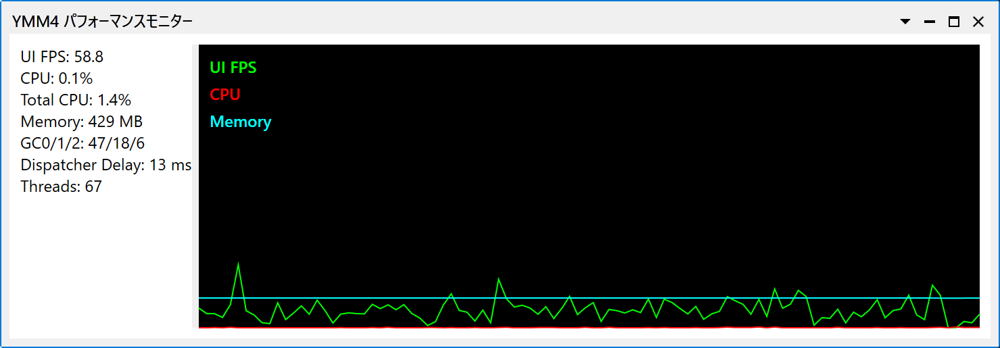

# 🟦 YMM4パフォーマンスモニタープラグイン

 

**YMM4パフォーマンスモニタープラグイン** は、[YukkuriMovieMaker4](https://manjubox.net/ymm4/)用のパフォーマンス監視プラグインです。

## 💡 特長

- YMM4のタイムライン再生・レンダリング時のシステムリソース使用状況をリアルタイム表示
- CPU、メモリなどの主要な指標を可視化

> [!NOTE]
> 注意：プレビューエリアの負荷は現在計測できません

## ⬇️ インストール方法

1. 本リポジトリの[Releases](./releases)から最新の`YMM4PerfMonitorPlugin.v*.*.*.ymme`をダウンロード
2. ダウンロードしたymmeをダブルクリックしてインストール
3. YMM4を再起動

## 🛠️ 使い方

1. YMM4を起動し、メニューから「ツール」→「YMM4 パフォーマンスモニター」を選択
2. プラグインウィンドウで各種リソース情報を確認

## 📋 パラメータ

> [!IMPORTANT]
> 注意：計算方法が異なるためタスクマネージャの数字と合いません。重い時の目安に使ってください。

- UI FPS:
  - YMM4本体のUI全体のフレームレート（WPF描画の滑らかさ）。※プレビューエリアのDirectX描画負荷は測定できません
  - 指標：UI応答性・描画の滑らかさ
- CPU:
  - プロセス（YMM4本体）単体のCPU使用率（%）
  - 指標：YMM4本体がどれだけCPUリソースを消費しているか
- Total CPU:
  - システム全体（全プロセス合計）のCPU使用率（%）
  - 指標：PC全体のCPU負荷状況
- Memory:
  - YMM4本体プロセス（＝プラグインが動作しているプロセス）の物理メモリ使用量（ワーキングセット）(MB)
  - 指標：YMM4本体が消費している物理メモリ量
- GC0/1/2:
  - .NETガベージコレクションの各世代（第0/1/2世代）で発生したコレクション回数
  - 指標：メモリ管理の負荷やGC発生頻度の目安
- Dispatcher Delay:
  - YMM4のUI（WPF）のUIスレッド（Dispatcher）で処理が遅延した時間（ミリ秒）
  - 指標：UI応答性の低下や処理詰まりの兆候
- Threads:
  - YMM4本体プロセス内で動作しているスレッド数
  - 指標：リソース消費やパフォーマンス低下の兆候（極端に多い場合は注意）

## 🏷️動作環境

- YukkuriMovieMaker4 v4.44.0以降
- Windows 10/11
- .NET 9.0以上

## 📄 ライセンス

> MIT License © 2025 - InuInu

- ライセンス詳細: [LICENSE](./LICENSE)
- 使用ライセンス一覧: [licenses/](./licenses/)

## 貢献

バグ報告・機能要望・プルリクエスト歓迎です。IssueまたはPull Requestからご連絡ください。

## 🔗 リンク

- [作者のGitHub](https://github.com/InuInu2022)
- [YMM4公式サイト](https://manjubox.net/ymm4/)
